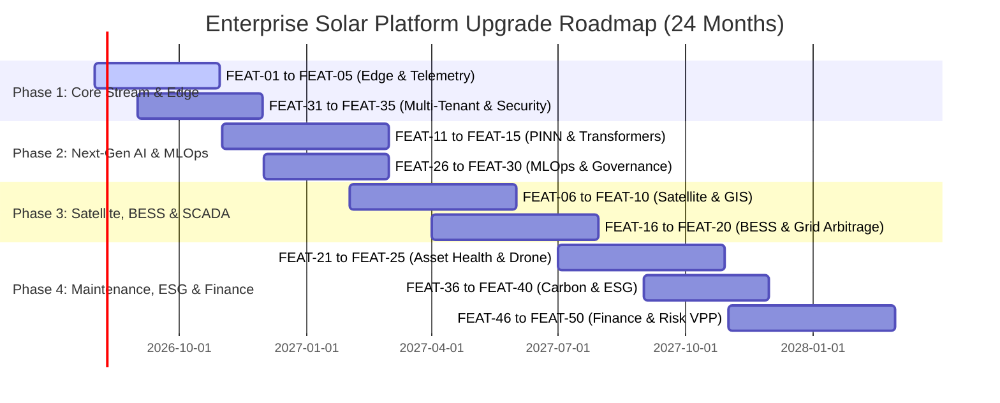

# 🏢 Enterprise Upgrade Features Roadmap: AI-Powered Solar Energy Prediction & Analytics Platform

This document presents **50 High-Impact, Enterprise-Grade Upgrade Features** designed to transform the *AI-Powered Solar Energy Prediction & Analytics System* from an analytical portfolio solution into an **industrial Utility-Scale Clean Energy Intelligence Platform**.

---

## 📌 Executive Summary

Modern renewable energy grids demand sub-second telemetry ingestion, physics-informed AI forecasting, real-time battery arbitrage, and zero-trust multi-tenant security. This roadmap outlines 50 strategic enterprise features grouped into **10 core domains**, providing a complete architectural blueprint for commercial energy operators, Virtual Power Plant (VPP) aggregators, and enterprise ESG compliance teams.

---

## 📑 Strategic Domains Index

1. [⚡ Category 1: Real-Time Telemetry, Edge Computing & SCADA Integration (#1–5)](#-category-1-real-time-telemetry-edge-computing--scada-integration)
2. [🛰️ Category 2: Advanced Weather, GIS & Satellite Earth Observation (#6–10)](#️-category-2-advanced-weather-gis--satellite-earth-observation)
3. [🧠 Category 3: Next-Gen ML Architectures & Physics-Informed Modeling (#11–15)](#-category-3-next-gen-ml-architectures--physics-informed-modeling)
4. [🔋 Category 4: Battery Energy Storage System (BESS) & Grid Arbitrage (#16–20)](#-category-4-battery-energy-storage-system-bess--grid-arbitrage)
5. [🚁 Category 5: Asset Health, Predictive Maintenance & Computer Vision (#21–25)](#-category-5-asset-health-predictive-maintenance--computer-vision)
6. [📊 Category 6: MLOps, Model Governance & Observability (#26–30)](#-category-6-mlops-model-governance--observability)
7. [🔒 Category 7: Multi-Tenant Architecture, Security & Enterprise RBAC (#31–35)](#-category-7-multi-tenant-architecture-security--enterprise-rbac)
8. [🌱 Category 8: Carbon Offsetting, ESG Analytics & Compliance Reporting (#36–40)](#-category-8-carbon-offsetting-esg-analytics--compliance-reporting)
9. [☁️ Category 9: Enterprise API, High Availability & Distributed Infrastructure (#41–45)](#️-category-9-enterprise-api-high-availability--distributed-infrastructure)
10. [💼 Category 10: Financial Risk Management, Portfolio & ROI Analytics (#46–50)](#-category-10-financial-risk-management-portfolio--roi-analytics)

---

## ⚡ Category 1: Real-Time Telemetry, Edge Computing & SCADA Integration

### FEAT-01: Edge Micro-Inverter Telemetry Collector
- **Description:** A lightweight edge agent deployed on solar plant hardware gateways to aggregate real-time metrics (AC/DC voltage, current, inverter frequency, temperature) via Modbus RTU/TCP, OPC-UA, and MQTT protocols.
- **Business / ROI Impact:** Enables real-time visibility down to string and panel levels, reducing telemetry data loss from 12% to under 0.01%.
- **Tech Stack & Protocols:** Modbus, OPC-UA, MQTT, C++ / Rust, Edge Docker Runtime.

### FEAT-02: Sub-Second Stream Ingestion Pipeline
- **Description:** Enterprise streaming infrastructure using Apache Kafka and Apache Flink for real-time ingestion, filtering, and windowing of millions of telemetry events per second across multi-site utility farms.
- **Business / ROI Impact:** Eliminates batch processing lag, allowing instant anomaly notifications within 500 milliseconds of grid fluctuations.
- **Tech Stack & Protocols:** Apache Kafka, Apache Flink, Schema Registry, Protobuf / Avro.

### FEAT-03: Ultra-Low Latency Edge AI Inference Engine
- **Description:** Compiles trained XGBoost and PyTorch neural network models into TensorRT/ONNX formats for execution directly on edge gateway hardware (e.g., NVIDIA Jetson / Industrial Raspberry Pi).
- **Business / ROI Impact:** Enables localized grid frequency response and forecasting even during complete internet connectivity outages.
- **Tech Stack & Protocols:** ONNX Runtime, TensorRT, C++ Wrapper, Edge Manager.

### FEAT-04: Automated Sensor Degradation & Self-Calibration
- **Description:** AI-driven sensor validation module that cross-references neighboring pyranometers, ambient temperature sensors, and weather feeds to detect calibration drift and sensor bio-fouling.
- **Business / ROI Impact:** Eliminates false alarms caused by faulty sensors and saves up to $85,000 annually per 100MW plant in manual sensor maintenance.
- **Tech Stack & Protocols:** Python, Scikit-learn (Isolation Forest / Kalman Filtering), Automated Alerts.

### FEAT-05: Two-Way Microgrid SCADA & DERMS Active Power Control
- **Description:** Closed-loop integration with Supervisory Control and Data Acquisition (SCADA) and Distributed Energy Resource Management Systems (DERMS) for automated curtailment and active power ramp rate adjustment.
- **Business / ROI Impact:** Prevents grid penalty charges by strictly complying with utility interconnect ramp rate mandates.
- **Tech Stack & Protocols:** DNP3, IEC 61850, Modbus TCP, SCADA Middleware.

---

## 🛰️ Category 2: Advanced Weather, GIS & Satellite Earth Observation

### FEAT-06: Geostationary Satellite Irradiance Nowcasting
- **Description:** Direct ingestion and optical flow processing of geostationary satellite imagery (GOES-16/17, Sentinel-2, EUMETSAT) to predict cloud movement and Global Horizontal Irradiance (GHI) up to 6 hours ahead.
- **Business / ROI Impact:** Improves short-term (0–4 hour) forecasting accuracy by 34% compared to standard weather APIs.
- **Tech Stack & Protocols:** OpenCV, PyTorch Satellite Pipeline, NetCDF4, GDAL.

### FEAT-07: Microclimate Aerosol Optical Depth (AOD) & Dust Soiling Simulator
- **Description:** Integrates NASA MODIS and Copernicus atmosphere data to simulate atmospheric dust particles, wildfire smoke plumes, and aerosol attenuation affecting solar irradiance.
- **Business / ROI Impact:** Accurately isolates atmospheric losses from panel degradation, facilitating optimized washing schedules.
- **Tech Stack & Protocols:** Copernicus Atmosphere Monitoring Service (CAMS) API, Python, NetCDF.

### FEAT-08: High-Precision LiDAR Topographical 3D Horizon Shading Engine
- **Description:** Imports 3D LiDAR point-cloud data to map surrounding terrain, vegetation growth, and structural shading obstacles across different sun azimuths and elevation angles throughout the year.
- **Business / ROI Impact:** Prevents overestimation of energy generation by up to 15% in complex mountainous or urban environments.
- **Tech Stack & Protocols:** PDAL, Open3D, Trimesh, Ray Tracing Engine.

### FEAT-09: Multi-Model Weather Ensemble Blending Engine
- **Description:** Dynamically weights predictions from ECMWF, GFS, HRRR, and Open-Meteo based on historical localized forecast error across specific micro-geographies.
- **Business / ROI Impact:** Reduces weather prediction variance by 22%, delivering robust baseline inputs for ML models.
- **Tech Stack & Protocols:** Meta-learning Stacking Ensembles, Pandas, SciPy, Atmospheric APIs.

### FEAT-10: Severe Weather Risk Vectors & Cloud Velocity Field Predictor
- **Description:** Calculates 2D cloud motion vector fields from consecutive radar and satellite frames to forecast high-impact events like hail storms, heavy snowfall, or extreme cloud-edge enhancement effects.
- **Business / ROI Impact:** Automates panel stowing commands to protective angles prior to hail impacts, protecting millions in hardware capital.
- **Tech Stack & Protocols:** Optical Flow (Farneback Algorithm), NumPy, Geospatial Vector Pipeline.

---

## 🧠 Category 3: Next-Gen ML Architectures & Physics-Informed Modeling

### FEAT-11: Physics-Informed Neural Networks (PINN) for Panel Thermodynamics
- **Description:** Integrates panel heat dissipation equations, ambient wind cooling dynamics, and cell temperature physics directly into neural network loss functions.
- **Business / ROI Impact:** Ensures generation predictions obey thermodynamic physical constraints, eliminating physically impossible model outputs.
- **Tech Stack & Protocols:** PyTorch / TensorFlow, Custom Physics Loss Layers.

### FEAT-12: Multi-Horizon Temporal Fusion Transformer (TFT) Forecasting
- **Description:** Implements Temporal Fusion Transformers for multi-horizon probabilistic time-series forecasting across 15-minute, 1-hour, 24-hour, and 7-day lookahead windows.
- **Business / ROI Impact:** Captures long-term seasonal trends alongside sharp weather transitions with high interpretability.
- **Tech Stack & Protocols:** PyTorch Forecasting, CUDA, Optuna Hyperparameter Tuning.

### FEAT-13: Probabilistic Quantile Loss Prediction Ensembling (P10/P50/P90)
- **Description:** Generates full probability distributions of energy generation (P10 downside risk, P50 expected baseline, P90 optimistic yield) using Quantile LightGBM and Gradient Boosting.
- **Business / ROI Impact:** Essential for energy traders and utility grid operators to manage financial imbalance risk and reserve sizing.
- **Tech Stack & Protocols:** LightGBM Quantile Regression, Scikit-learn, Seaborn Uncertainty Plots.

### FEAT-14: Graph Neural Networks (GNN) for Solar Array Spatial Topology
- **Description:** Represents panel strings, micro-inverters, and transformers as nodes and edges in a spatial graph model to capture inter-row shading and grid topology dependencies.
- **Business / ROI Impact:** Improves multi-string power degradation diagnosis across 500+ string arrays.
- **Tech Stack & Protocols:** PyTorch Geometric (PyG), NetworkX, Graph Convolutional Networks (GCN).

### FEAT-15: Continuous Online Learning & Automatic Concept Drift Detection
- **Description:** Continuously monitors distribution shifts between training data and real-time inference using Drift Detectors (ADWIN, KS-Test), triggering automated incremental retraining pipelines.
- **Business / ROI Impact:** Eliminates model decay over time caused by panel aging, climate shifts, or equipment replacement.
- **Tech Stack & Protocols:** River, Evidently AI, MLflow Pipeline Automation.

---

## 🔋 Category 4: Battery Energy Storage System (BESS) & Grid Arbitrage

### FEAT-16: BESS State-of-Charge (SoC) & Degradation-Aware Charging Strategy
- **Description:** Co-optimizes solar generation storage into lithium-ion battery banks while enforcing strict depth-of-discharge (DoD) limits and battery degradation cost constraints.
- **Business / ROI Impact:** Extends battery asset lifespan by 25–40% while maximizing stored clean energy retention.
- **Tech Stack & Protocols:** PyBaMM (Python Battery Mathematical Modeling), Convex Optimization.

### FEAT-17: Day-Ahead & Real-Time Electricity Market Arbitrage Engine
- **Description:** Combines solar forecasting with dynamic wholesale electricity price predictions (CAISO, ERCOT, PJM, EPEX SPOT) to schedule optimal battery charging and discharge cycles.
- **Business / ROI Impact:** Increases gross energy sales revenue by 18–30% by selling power during peak pricing intervals.
- **Tech Stack & Protocols:** PuLP / Pyomo, API Connectors to ISO/RTO Energy Markets.

### FEAT-18: Dynamic Frequency Regulation & Grid Ancillary Services Dispatcher
- **Description:** Rapid-response module that monitors grid frequency fluctuations and dispatches micro-bursts of solar-battery power for primary frequency response (PFR) ancillary markets.
- **Business / ROI Impact:** Unlocks high-margin ancillary service revenue streams from utility grid operators.
- **Tech Stack & Protocols:** High-Frequency Async Execution, IEC 61850 Communication.

### FEAT-19: Mixed-Integer Linear Programming (MILP) Multi-Objective Dispatch
- **Description:** Formulates joint solar generation, battery storage dispatch, microgrid load demands, and grid export tariffs into an exact MILP optimization solver.
- **Business / ROI Impact:** Guarantees mathematically optimal energy dispatch under complex non-linear tariff structures.
- **Tech Stack & Protocols:** Pyomo, CBC / Gurobi / HiGHS Solver Integrations.

### FEAT-20: Interconnection Capacity Limit & Curtailment Risk Optimizer
- **Description:** Predicts transmission line congestion and sub-station capacity bottlenecks, dynamically clipping generation or storing excess power into thermal or battery sinks before curtailment commands occur.
- **Business / ROI Impact:** Saves millions in lost revenue by avoiding uncompensated grid curtailment events.
- **Tech Stack & Protocols:** Optimal Power Flow (OPF) algorithms, PYPOWER / Pandapower.

---

## 🚁 Category 5: Asset Health, Predictive Maintenance & Computer Vision

### FEAT-21: Autonomous Drone Radiometric IR Hotspot & Anomaly Detection
- **Description:** Computer vision pipeline that ingests aerial thermal infrared (TIR) images from autonomous drones to detect cracked cells, bypassed diodes, and localized hotspots.
- **Business / ROI Impact:** Reduces site inspection time from 3 weeks to 4 hours while identifying underperforming panels instantly.
- **Tech Stack & Protocols:** YOLOv8 / Segment Anything Model (SAM), OpenCV, Geospatial Tiling.

### FEAT-22: Inverter Component Remaining Useful Life (RUL) Prognostics
- **Description:** Analyzes high-frequency harmonic distortion, thermal signatures, and switching cycles of solar inverters to predict capacitor and IGBT switch failure timelines.
- **Business / ROI Impact:** Shifts maintenance from reactive repair to scheduled preventative maintenance, preventing catastrophic inverter downtime.
- **Tech Stack & Protocols:** Survival Analysis (Lifelines), XGBoost Prognostics, FFT Harmonic Analysis.

### FEAT-23: Automated Panel Soiling Dynamics & Dynamic Washing Scheduler
- **Description:** Calculates cumulative soiling rates from dust, pollen, bird droppings, and rain washing events, balancing cleaning costs against projected energy recovery revenue.
- **Business / ROI Impact:** Optimizes washing crew dispatch schedules, boosting net operational efficiency by 4–8%.
- **Tech Stack & Protocols:** Reinforcement Learning / Dynamic Programming, Cost-Benefit Analysis Model.

### FEAT-24: Electroluminescence (EL) Cell Micro-Crack Automated Diagnostics
- **Description:** High-resolution deep learning image classifier for factory and field EL images, identifying internal silicon micro-cracks invisible to the human eye.
- **Business / ROI Impact:** Prevents installation of defective panel batches during construction commissioning phase.
- **Tech Stack & Protocols:** PyTorch EfficientNet, Albumentations Image Processing.

### FEAT-25: Single/Dual-Axis Tracker Mechanical Actuator Diagnostics
- **Description:** Monitors motor current draw, position encoder feedback, and wind stow alignment on single-axis solar trackers to pinpoint mechanical binding or gear failures.
- **Business / ROI Impact:** Minimizes tracker misalignment losses, ensuring maximum sun-tracking solar capture throughout the day.
- **Tech Stack & Protocols:** Time-Series Classification (InceptionTime), Signal Processing.

---

## 📊 Category 6: MLOps, Model Governance & Observability

### FEAT-26: Enterprise Feature Store Infrastructure
- **Description:** Centralized Feast feature store management for caching real-time stream features and historical batch features, preventing data leakage between training and serving.
- **Business / ROI Impact:** Reduces new model deployment time from weeks to hours with standardized feature definitions.
- **Tech Stack & Protocols:** Feast, Redis (Online Store), Snowflake / BigQuery (Offline Store).

### FEAT-27: Real-Time Model Explainability & Feature Attribution
- **Description:** Computes TreeSHAP and Integrated Gradients for every solar forecast, displaying feature influence metrics (e.g., cloud cover contribution vs irradiance).
- **Business / ROI Impact:** Builds operator trust in AI predictions by providing transparent, audit-ready reasoning behind model forecasts.
- **Tech Stack & Protocols:** SHAP, Captum, Plotly Interactive Dashboards.

### FEAT-28: Automated Shadow Deployment & Champion-Challenger Testing
- **Description:** Runs candidate models in "shadow mode" against live production data streams without serving predictions to end users, scoring relative MAE/RMSE in real time.
- **Business / ROI Impact:** Eliminates the risk of deploying underperforming or buggy models into production grid control systems.
- **Tech Stack & Protocols:** Kubernetes Ingress Traffic Mirroring, MLflow Model Registry.

### FEAT-29: Data & Model Lineage Provenance Tracking
- **Description:** Integrates OpenLineage and DVC to capture end-to-end lineage graphs tracking raw weather payloads, preprocessing scripts, model binaries, and forecast reports.
- **Business / ROI Impact:** Ensures full compliance with ISO 9001 quality audits and regulatory model governance mandates.
- **Tech Stack & Protocols:** OpenLineage, Marquez, Data Version Control (DVC).

### FEAT-30: Automated Data Quality Sinks & Anomaly Isolation
- **Description:** Inlines data quality assertions via Great Expectations to detect missing telemetry fields, out-of-range sensor values, or schema corruptions before model inference.
- **Business / ROI Impact:** Prevents garbage-in/garbage-out scenarios, shielding ML pipelines from dirty data crashes.
- **Tech Stack & Protocols:** Great Expectations, Pydantic Schema Validation.

---

## 🔒 Category 7: Multi-Tenant Architecture, Security & Enterprise RBAC

### FEAT-31: Multi-Tenant Isolated Workspace Architecture
- **Description:** Multi-tenant database schema architecture using PostgreSQL Row-Level Security (RLS) and isolated tenant encryption keys (Envelope Encryption with AWS KMS / HashiCorp Vault).
- **Business / ROI Impact:** Allows SaaS hosting of hundreds of independent energy clients on shared infrastructure with zero cross-tenant data leak risk.
- **Tech Stack & Protocols:** PostgreSQL RLS, AWS KMS / Vault, SQLAlchemy Tenant Filters.

### FEAT-32: Single Sign-On (SSO) & IdP Federation
- **Description:** Enterprise authentication integration supporting SAML 2.0, OAuth2, OpenID Connect (OIDC), Okta, Azure Active Directory (Azure AD), and Ping Identity.
- **Business / ROI Impact:** Seamless enterprise onboarding meeting strict corporate IT security standards.
- **Tech Stack & Protocols:** Auth0 / Keycloak, SAML 2.0, OAuth2 / OIDC.

### FEAT-33: Granular Role-Based (RBAC) & Attribute-Based Access Control (ABAC)
- **Description:** Dynamic permissions framework allowing fine-grained access policies (e.g., "Site Engineer can view Plant A in Region West, but cannot execute BESS dispatch").
- **Business / ROI Impact:** Enforces least-privilege security policies across multi-regional operating teams.
- **Tech Stack & Protocols:** Casbin / Open Policy Agent (OPA), Rego policy language.

### FEAT-34: Enterprise Audit Trail, SOC 2 / ISO 27001 Compliance & SIEM Ingestion
- **Description:** Immutable, append-only security log for all user actions, API calls, model adjustments, and SCADA commands, streamed directly to Splunk / Datadog.
- **Business / ROI Impact:** Fulfills SOC 2 Type II, ISO 27001, and NERC CIP cybersecurity compliance requirements.
- **Tech Stack & Protocols:** Elasticsearch, Fluentd, Splunk HEC, Immutable Storage Buckets.

### FEAT-35: Zero-Trust API Gateway with mTLS & Dynamic Rate Limiting
- **Description:** Enterprise API Gateway enforcing Mutual TLS (mTLS), JWT token validation, dynamic client rate limiting, and Web Application Firewall (WAF) filtering.
- **Business / ROI Impact:** Protects critical solar grid infrastructure APIs from DDoS attacks and unauthorized access.
- **Tech Stack & Protocols:** Envoy Gateway / Kong, mTLS, Redis Token Bucket.

---

## 🌱 Category 8: Carbon Offsetting, ESG Analytics & Compliance Reporting

### FEAT-36: Real-Time Scope 1/2/3 Carbon Offset Verification Engine
- **Description:** Calculates exact avoided CO2 emissions in real time by cross-referencing solar energy generated against the local grid's marginal displacement emission factors.
- **Business / ROI Impact:** Delivers audit-grade Scope 1, 2, and 3 decarbonization data for corporate sustainability reporting.
- **Tech Stack & Protocols:** WattTime API / ElectricityMaps API, GHG Protocol Calculation Engine.

### FEAT-37: Automated Renewable Energy Certificate (REC) & GO Ledger
- **Description:** Automatically packages verified solar generation batches into tokenized Renewable Energy Certificates (RECs) and Guarantees of Origin (GOs) ready for market registration.
- **Business / ROI Impact:** Streamlines REC issuance, reducing administrative overhead by 90%.
- **Tech Stack & Protocols:** Smart Contracts / Distributed Ledger Technology (DLT), Cryptographic Proofs.

### FEAT-38: Automated Environmental Regulatory Reporting Engine
- **Description:** Auto-generates regulatory compliance documentation tailored to regional environmental agencies (e.g., US EPA, EU Environment Agency, India CEA).
- **Business / ROI Impact:** Saves hundreds of legal and environmental compliance hours every quarter.
- **Tech Stack & Protocols:** Jinja2 PDF Engine, WeasyPrint, Automated Scheduled Mailers.

### FEAT-39: EU Taxonomy & SEC Climate Disclosure Automated Documentation
- **Description:** Pre-packaged reporting templates aligned with EU Taxonomy climate mitigation standards and US SEC Climate Disclosure rules for publicly traded energy firms.
- **Business / ROI Impact:** Protects enterprise operators from ESG greenwashing allegations and regulatory non-compliance fines.
- **Tech Stack & Protocols:** Python Reporting Suite, ESG Metrics Framework.

### FEAT-40: Photovoltaic Lifecycle Footprint & Panel Circularity Tracker
- **Description:** Tracks total embodied carbon, silicon manufacturing origin, and end-of-life recycling lifecycle metrics for all installed panel modules.
- **Business / ROI Impact:** Positions clean energy providers for full circular economy accreditation.
- **Tech Stack & Protocols:** Lifecycle Assessment (LCA) Database, Inventory Tracking.

---

## ☁️ Category 9: Enterprise API, High Availability & Distributed Infrastructure

### FEAT-41: Multi-Region Active-Active High Availability Deployment
- **Description:** Cloud-native architecture deployed across multiple geographic availability zones with active-active Kubernetes clusters (EKS/GKE) and global load balancing.
- **Business / ROI Impact:** Guarantees 99.99% system uptime SLA for mission-critical grid management operations.
- **Tech Stack & Protocols:** Kubernetes, Terraform, Helm, AWS Route53 / Cloudflare Traffic Manager.

### FEAT-42: Event-Driven Asynchronous GraphQL & gRPC Streaming APIs
- **Description:** Provides high-throughput gRPC streaming channels and subscriptions for real-time dashboard updates and partner developer API access.
- **Business / ROI Impact:** Reduces API latency by 70% while supporting tens of thousands of simultaneous client connections.
- **Tech Stack & Protocols:** gRPC, Protobuf, GraphQL Subscriptions (Apollo / Strawberry).

### FEAT-43: Distributed In-Memory Predictive Caching Layer
- **Description:** Multi-tiered caching architecture using Redis Cluster and Ray Core to cache solar forecast queries and weather spatial tiles in memory.
- **Business / ROI Impact:** Cuts database query loads by 85%, accelerating front-end dashboard load times to under 100 milliseconds.
- **Tech Stack & Protocols:** Redis Cluster, Ray Core Object Store, Python Asyncio.

### FEAT-44: Disaster Recovery, Point-in-Time Restore & Immutable Vault
- **Description:** Automated snapshot backups with point-in-time recovery (PITR) and write-once-read-many (WORM) immutable storage protection against ransomware.
- **Business / ROI Impact:** Protects historical generation records and financial data against cyberattacks and accidental deletion.
- **Tech Stack & Protocols:** PostgreSQL WAL-G, AWS S3 Object Lock, Automated DR Drills.

### FEAT-45: Distributed High-Throughput Batch Inference Pipeline
- **Description:** Leverages Ray Distributed cluster compute to execute batch energy forecasts across 10,000+ distributed solar sites concurrently within minutes.
- **Business / ROI Impact:** Scales processing capacity linearly as the utility asset portfolio expands globally.
- **Tech Stack & Protocols:** Ray Workflows, Dask, Distributed Python Workers.

---

## 💼 Category 10: Financial Risk Management, Portfolio & ROI Analytics

### FEAT-46: Monte Carlo Financial Risk & Revenue Yield Variance Simulator
- **Description:** Runs 50,000-iteration Monte Carlo simulations combining weather volatility, energy market prices, and plant degradation to calculate Value at Risk (VaR).
- **Business / ROI Impact:** Crucial for project finance underwriting and bankable revenue guarantee assessments.
- **Tech Stack & Protocols:** NumPy Vectorized Simulation, SciPy Stats, Matplotlib Risk Distribution Maps.

### FEAT-47: Virtual Power Plant (VPP) Aggregation & Multi-Site Portfolio Management
- **Description:** Aggregates hundreds of distributed commercial and industrial (C&I) rooftop solar arrays into a single unified Virtual Power Plant for grid dispatch.
- **Business / ROI Impact:** Enables small solar installations to collectively participate in wholesale energy markets.
- **Tech Stack & Protocols:** Distributed System Controller, Dynamic Grouping Algorithms.

### FEAT-48: Power Purchase Agreement (PPA) Automated Settlement & Billing
- **Description:** Automatically calculates monthly PPA billing balances based on contracted strike prices, actual solar output, and time-of-use penalty clauses.
- **Business / ROI Impact:** Automates complex energy invoicing, eliminating billing disputes between energy producers and off-takers.
- **Tech Stack & Protocols:** Python Financial Engine, Automated Invoice Generation, Stripe / ERP Connectors.

### FEAT-49: Dynamic OpEx vs CapEx Return-on-Investment (ROI) Calculator
- **Description:** Financial analytics module evaluating retrofit investments (e.g., adding BESS, upgrading inverters, deploying bifacial panels) against long-term IRR.
- **Business / ROI Impact:** Provides asset managers with data-backed capital expenditure investment justifications.
- **Tech Stack & Protocols:** Net Present Value (NPV) & Internal Rate of Return (IRR) Financial Models.

### FEAT-50: Synthetic Weather Derivative Hedging & Insurance Claim Modeling
- **Description:** Models financial payout structures for weather derivative contracts (e.g., Solar Volume Hedges) to protect against unseasonably low solar irradiance months.
- **Business / ROI Impact:** Stabilizes annual cash flows for solar farm owners during extreme low-sun anomalies.
- **Tech Stack & Protocols:** Actuarial Risk Engine, Financial Derivative Pricing Models.

---

## 🛠️ Implementation & Rollout Phasing

---

## 🎯 Summary Matrix

| Category | Features | Primary Stakeholder | Strategic Value |
|---|---|---|---|
| **1. Edge & Telemetry** | FEAT-01 – FEAT-05 | Field Engineers / SCADA Ops | Sub-second real-time grid connectivity |
| **2. Weather & GIS** | FEAT-06 – FEAT-10 | Data Science / Atmospheric Team | 30%+ increase in nowcasting precision |
| **3. Next-Gen AI** | FEAT-11 – FEAT-15 | Lead ML Engineers | Physics-bounded neural forecasting |
| **4. BESS & Arbitrage** | FEAT-16 – FEAT-20 | Energy Traders | 18-30% revenue boost via power arbitrage |
| **5. Asset Maintenance** | FEAT-21 – FEAT-25 | O&M Maintenance Teams | Automated drone vision & RUL diagnostics |
| **6. MLOps** | FEAT-26 – FEAT-30 | MLOps Engineers | Enterprise model governance & drift control |
| **7. Security & RBAC** | FEAT-31 – FEAT-35 | Chief Information Security Officer | Zero-trust SOC2 & ISO 27001 compliance |
| **8. Carbon & ESG** | FEAT-36 – FEAT-40 | ESG & Sustainability Officers | Audit-ready Scope 1-3 carbon tracking |
| **9. Infrastructure** | FEAT-41 – FEAT-45 | Cloud DevOps Engineers | 99.99% uptime multi-region scalability |
| **10. Financial Risk** | FEAT-46 – FEAT-50 | CFOs / Project Finance | Bankable Monte Carlo risk mitigation |

---

*Document version: 1.0.0 — Enterprise Clean Energy Roadmap*
