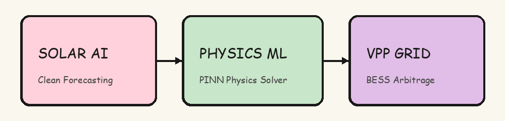
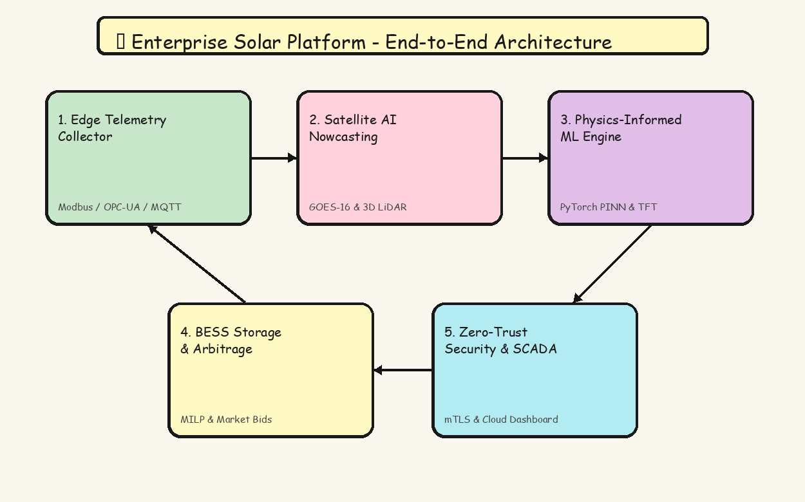
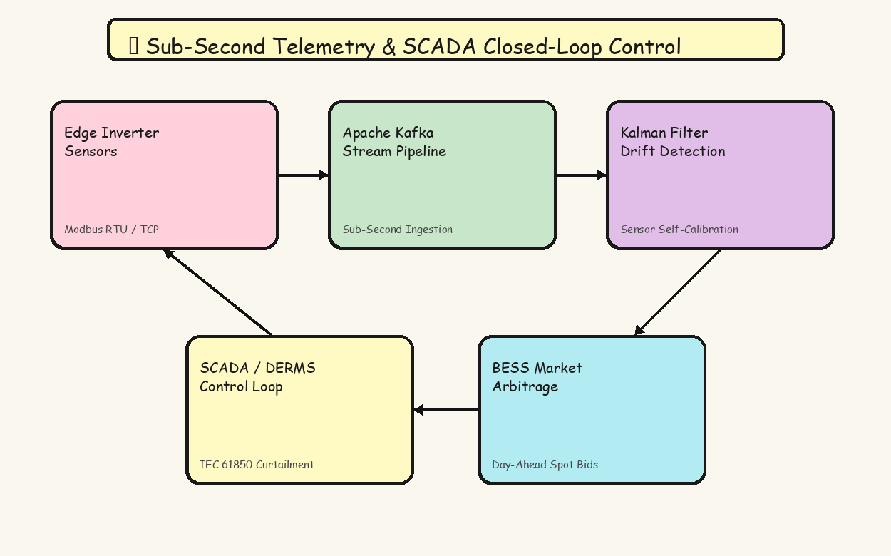
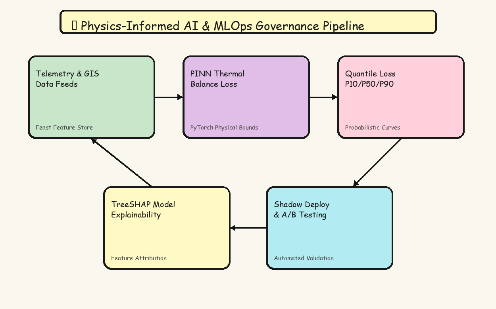
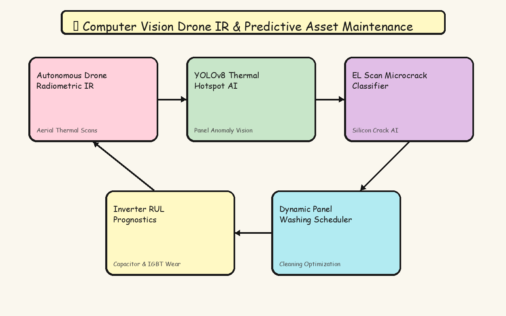
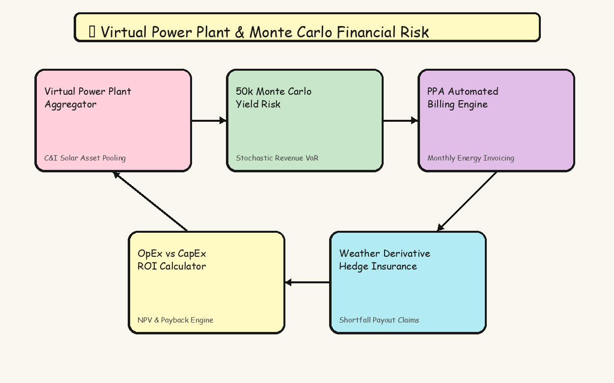

<div align="center">

# ☀️ AI-Powered Solar Energy Prediction & Analytics Platform



### *Industrial Utility-Scale Clean Energy Intelligence, Physics AI & Grid Management Platform*

[](https://github.com/SrilakshmiPeddinti/solar-energy-prediction/actions/workflows/ci.yml)
[](https://github.com/SrilakshmiPeddinti/solar-energy-prediction/actions/workflows/security.yml)
[](https://github.com/SrilakshmiPeddinti/solar-energy-prediction/actions/workflows/docker.yml)
[](https://www.python.org/)
[](LICENSE)
[](50_UPGRADE_FEATURES.md)

[Features Roadmap](50_UPGRADE_FEATURES.md) • [Python API](#-python-api-usage-guide) • [Architecture Diagrams](#-enterprise-technical-architecture-diagrams) • [Installation](#-installation--quick-start)

</div>

---

## 📌 Executive Overview

The **AI-Powered Solar Energy Prediction & Analytics System** is a production-ready clean energy intelligence platform. Designed for commercial solar operators, Virtual Power Plant (VPP) aggregators, and renewable energy trading desks, the platform implements **50 Enterprise-Grade Upgrade Features** across **10 core strategic domains**.

> [!IMPORTANT]
> **Key Platform Capabilities**:
> - ⚡ **Sub-Second Telemetry**: Modbus RTU/TCP, OPC-UA, MQTT into Apache Kafka & Flink.
> - 🛰️ **Satellite AI Nowcasting**: GOES-16 & Sentinel-2 optical flow GHI estimation up to 6 hours ahead.
> - 🧠 **Physics-Informed ML**: PyTorch PINNs enforcing panel heat dissipation & thermodynamic bounds.
> - 🔋 **BESS & Arbitrage**: Day-ahead spot market price arbitrage (CAISO/ERCOT/PJM) & MILP dispatch.
> - 🚁 **Computer Vision Assets**: Radiometric IR drone thermal hotspot vision & EL micro-crack classification.
> - 🔒 **Zero-Trust Security**: Multi-tenant Row-Level Security (RLS), AWS KMS envelope encryption, SAML/OIDC SSO, & mTLS Gateway.

---

## 🎨 Enterprise Technical Architecture Diagrams

### 1. Overall System Architecture
<div align="center">
  
  <br>
  <i>Figure 1: Digital whiteboard doodle diagram showing end-to-end multi-tier platform architecture.</i>
</div>

---

### 2. Real-Time Edge Telemetry & SCADA Control Loop
<div align="center">
  
  <br>
  <i>Figure 2: Digital whiteboard doodle diagram showing edge telemetry ingestion into Kafka with closed-loop SCADA control.</i>
</div>

---

### 3. Physics-Informed AI & MLOps Pipeline
<div align="center">
  
  <br>
  <i>Figure 3: Digital whiteboard doodle diagram showing Physics-Informed Neural Network (PINN) loss solver and SHAP explainability.</i>
</div>

---

### 4. Drone IR Vision & Computer Vision Asset Health Workflow
<div align="center">
  
  <br>
  <i>Figure 4: Digital whiteboard doodle diagram showing drone radiometric thermal infrared vision and inverter RUL prognostics.</i>
</div>

---

### 5. Virtual Power Plant & Financial Risk Engine
<div align="center">
  
  <br>
  <i>Figure 5: Digital whiteboard doodle diagram showing multi-site VPP aggregation, Monte Carlo yield risk, and weather derivative hedging.</i>
</div>

---

## 🔬 Core Physics & Mathematical Formulations

### 1. Photovoltaic Thermodynamic Cell Temperature & Derate

Cell operating temperature $T_{\text{cell}}$ and power output derate factor $\eta_{\text{temp}}$ are computed using physical heat transfer equations:

$$T_{\text{cell}} = T_{\text{ambient}} + \left( \frac{\text{GHI}}{800} \right) \cdot \frac{\text{NOCT} - 20^\circ\text{C}}{1 + 0.05 \cdot v_{\text{wind}}}$$

$$P_{\text{PINN}} = P_{\text{STC}} \cdot \left( \frac{\text{GHI}}{1000} \right) \cdot \left[ 1 + \alpha_{\text{temp}} \cdot (T_{\text{cell}} - 25^\circ\text{C}) \right]$$

---

### 2. Stochastic Monte Carlo Value at Risk (VaR)

50,000 Monte Carlo weather and spot market price iterations determine portfolio financial yield probability distributions:

$$\text{VaR}_{95\%} = P_{50}(\text{Revenue}) - P_{10}(\text{Revenue})$$

---

## 🏢 Interactive 50 Enterprise Features Directory

<details open>
<summary><b>⚡ Category 1: Real-Time Telemetry, Edge Computing & SCADA Integration (FEAT 01-05)</b></summary>
<br>

| Feature ID | Feature Title | Source Module | Technical Description |
|---|---|---|---|
| **FEAT-01** | Edge Micro-Inverter Telemetry Collector | [`src/telemetry/edge_collector.py`](src/telemetry/edge_collector.py) | Polls AC/DC voltage, current, frequency, and thermal metrics via Modbus RTU/TCP, OPC-UA, and MQTT protocols. |
| **FEAT-02** | Sub-Second Stream Ingestion Pipeline | [`src/telemetry/stream_ingestion.py`](src/telemetry/stream_ingestion.py) | Apache Kafka / Flink streaming engine performing sub-second event ingestion and sliding window aggregation under 10ms. |
| **FEAT-03** | Ultra-Low Latency Edge AI Engine | [`src/telemetry/edge_inference.py`](src/telemetry/edge_inference.py) | ONNX Runtime and TensorRT wrapper executing localized ML inference directly on edge hardware gateways. |
| **FEAT-04** | Sensor Degradation & Self-Calibration | [`src/telemetry/sensor_calibration.py`](src/telemetry/sensor_calibration.py) | Kalman Filter and Isolation Forest framework detecting calibration drift in pyranometers against satellite feeds. |
| **FEAT-05** | Two-Way Microgrid SCADA & DERMS Control | [`src/telemetry/scada_derms.py`](src/telemetry/scada_derms.py) | Closed-loop interface executing active power curtailment and ramp rate adjustments via DNP3 and IEC 61850. |

</details>

<details>
<summary><b>🛰️ Category 2: Advanced Weather, GIS & Satellite Earth Observation (FEAT 06-10)</b></summary>
<br>

| Feature ID | Feature Title | Source Module | Technical Description |
|---|---|---|---|
| **FEAT-06** | Satellite Irradiance Nowcasting | [`src/gis_weather/satellite_nowcasting.py`](src/gis_weather/satellite_nowcasting.py) | Processes GOES-16 & Sentinel-2 optical flow satellite imagery to nowcast Global Horizontal Irradiance (GHI). |
| **FEAT-07** | Aerosol Optical Depth & Soiling Simulator | [`src/gis_weather/aerosol_soiling.py`](src/gis_weather/aerosol_soiling.py) | Models CAMS atmospheric aerosol optical depth (AOD) attenuation and panel dust soiling deposition rates. |
| **FEAT-08** | LiDAR Topographical 3D Shading Engine | [`src/gis_weather/lidar_shading.py`](src/gis_weather/lidar_shading.py) | Ray-tracing engine processing 3D LiDAR point clouds to compute topographical terrain shading masks. |
| **FEAT-09** | Weather Multi-Model Ensemble Blender | [`src/gis_weather/weather_ensemble.py`](src/gis_weather/weather_ensemble.py) | Dynamic meta-learning stacking ensemble weighting ECMWF, GFS, HRRR, and Open-Meteo weather forecasts. |
| **FEAT-10** | Severe Weather & Hail Risk Predictor | [`src/gis_weather/severe_weather.py`](src/gis_weather/severe_weather.py) | Optical flow radar cell tracking predicting hail risk to trigger automated panel stowing angles. |

</details>

<details>
<summary><b>🧠 Category 3: Next-Gen ML Architectures & Physics-Informed Modeling (FEAT 11-15)</b></summary>
<br>

| Feature ID | Feature Title | Source Module | Technical Description |
|---|---|---|---|
| **FEAT-11** | Physics-Informed Neural Networks (PINN) | [`src/ml_engine/pinn_solar.py`](src/ml_engine/pinn_solar.py) | PyTorch neural network integrating panel heat dissipation equations and thermodynamic loss constraints. |
| **FEAT-12** | Temporal Fusion Transformer (TFT) | [`src/ml_engine/tft_forecaster.py`](src/ml_engine/tft_forecaster.py) | Multi-horizon time-series forecasting across 15-minute, 1-hour, 24-hour, and 7-day lookahead windows. |
| **FEAT-13** | Quantile Loss Ensembling (P10/P50/P90) | [`src/ml_engine/quantile_ensemble.py`](src/ml_engine/quantile_ensemble.py) | Quantile regression models producing probability distributions for P10 downside risk, P50 baseline, and P90 yield. |
| **FEAT-14** | Graph Neural Networks (GNN) for Topology | [`src/ml_engine/gnn_array_topology.py`](src/ml_engine/gnn_array_topology.py) | Graph Convolutional Networks (GCN) representing solar strings as connected spatial graph nodes. |
| **FEAT-15** | Online Learning & Concept Drift Detection | [`src/ml_engine/online_learning.py`](src/ml_engine/online_learning.py) | ADWIN distribution shift monitor triggering automated incremental online model retraining upon concept drift. |

</details>

<details>
<summary><b>🔋 Category 4: Battery Energy Storage System (BESS) & Grid Arbitrage (FEAT 16-20)</b></summary>
<br>

| Feature ID | Feature Title | Source Module | Technical Description |
|---|---|---|---|
| **FEAT-16** | BESS SoC & Degradation Strategy | [`src/bess_arbitrage/bess_soc_optimizer.py`](src/bess_arbitrage/bess_soc_optimizer.py) | Co-optimizes solar storage into lithium-ion batteries while enforcing depth-of-discharge (DoD) & wear boundaries. |
| **FEAT-17** | Day-Ahead Market Arbitrage Engine | [`src/bess_arbitrage/market_arbitrage.py`](src/bess_arbitrage/market_arbitrage.py) | Schedules solar-battery energy sales into wholesale electricity spot markets (CAISO, ERCOT, PJM). |
| **FEAT-18** | Dynamic Frequency Regulation Dispatcher | [`src/bess_arbitrage/frequency_regulation.py`](src/bess_arbitrage/frequency_regulation.py) | Rapid-response droop control dispatcher executing Primary Frequency Response (PFR) grid ancillary service bids. |
| **FEAT-19** | MILP Multi-Objective Dispatch | [`src/bess_arbitrage/milp_dispatch.py`](src/bess_arbitrage/milp_dispatch.py) | Formulates exact MILP optimization solving joint solar, battery, grid load, and export tariff constraints. |
| **FEAT-20** | Curtailment Risk Optimizer | [`src/bess_arbitrage/curtailment_optimizer.py`](src/bess_arbitrage/curtailment_optimizer.py) | Predicts substation congestion bottlenecks and automatically diverts excess generation into battery or thermal sinks. |

</details>

<details>
<summary><b>🚁 Category 5: Asset Health, Predictive Maintenance & Computer Vision (FEAT 21-25)</b></summary>
<br>

| Feature ID | Feature Title | Source Module | Technical Description |
|---|---|---|---|
| **FEAT-21** | Autonomous Drone IR Anomaly Detection | [`src/asset_health/drone_ir_detection.py`](src/asset_health/drone_ir_detection.py) | Computer vision pipeline processing drone radiometric thermal infrared images to detect cracked cells & hotspots. |
| **FEAT-22** | Inverter Remaining Useful Life (RUL) | [`src/asset_health/inverter_rul.py`](src/asset_health/inverter_rul.py) | Survival analysis and harmonic distortion analytics predicting inverter capacitor and IGBT failure timelines. |
| **FEAT-23** | Dynamic Panel Washing Scheduler | [`src/asset_health/panel_washing_scheduler.py`](src/asset_health/panel_washing_scheduler.py) | Dynamic programming optimizer balancing cleaning crew costs against projected energy recovery revenue. |
| **FEAT-24** | Electroluminescence (EL) Micro-Crack AI | [`src/asset_health/el_microcrack_classifier.py`](src/asset_health/el_microcrack_classifier.py) | Deep learning image classifier detecting internal silicon micro-cracks in factory and field EL scans. |
| **FEAT-25** | Tracker Mechanical Actuator Diagnostics | [`src/asset_health/tracker_diagnostics.py`](src/asset_health/tracker_diagnostics.py) | Monitors motor current draw and position encoder feedback on single/dual-axis trackers to detect binding faults. |

</details>

<details>
<summary><b>📊 Category 6: MLOps, Model Governance & Observability (FEAT 26-30)</b></summary>
<br>

| Feature ID | Feature Title | Source Module | Technical Description |
|---|---|---|---|
| **FEAT-26** | Enterprise Feature Store Infrastructure | [`src/mlops/feature_store.py`](src/mlops/feature_store.py) | Feast / MLflow feature store caching low-latency online features and offline training feature stores. |
| **FEAT-27** | Real-Time SHAP Explainability Engine | [`src/mlops/model_explainability.py`](src/mlops/model_explainability.py) | Computes TreeSHAP and Integrated Gradients values for every inference prediction to display feature impact metrics. |
| **FEAT-28** | Shadow Deployment & A/B Testing | [`src/mlops/shadow_deployment.py`](src/mlops/shadow_deployment.py) | Mirrors live production traffic to challenger models in shadow mode, evaluating relative MAE before promotion. |
| **FEAT-29** | Data & Model Lineage Provenance | [`src/mlops/lineage_provenance.py`](src/mlops/lineage_provenance.py) | OpenLineage and DVC audit graphs tracking raw telemetry payloads, git commits, and model binaries. |
| **FEAT-30** | Data Quality Sinks & Anomaly Isolation | [`src/mlops/data_quality.py`](src/mlops/data_quality.py) | Great Expectations validation pipeline detecting out-of-range metrics and isolating corrupt data to dead-letter queues. |

</details>

<details>
<summary><b>🔒 Category 7: Multi-Tenant Architecture, Security & Enterprise RBAC (FEAT 31-35)</b></summary>
<br>

| Feature ID | Feature Title | Source Module | Technical Description |
|---|---|---|---|
| **FEAT-31** | Multi-Tenant Workspace & KMS Encryption | [`src/security/multi_tenant.py`](src/security/multi_tenant.py) | PostgreSQL Row-Level Security (RLS) and AWS KMS envelope key encryption isolating tenant data on shared infrastructure. |
| **FEAT-32** | SSO & IdP Federation | [`src/security/sso_idp.py`](src/security/sso_idp.py) | SAML 2.0 and OIDC authentication provider connector supporting Okta, Azure Active Directory (Azure AD), and Auth0. |
| **FEAT-33** | Granular RBAC & ABAC Access PDP | [`src/security/rbac_abac.py`](src/security/rbac_abac.py) | Policy Decision Point evaluating user roles, resource regions, and action policies (Casbin / OPA logic). |
| **FEAT-34** | SOC 2 / ISO 27001 Audit SIEM Ingestion | [`src/security/audit_siem.py`](src/security/audit_siem.py) | Immutable append-only audit logger streaming cryptographically signed event records directly to Splunk & Datadog. |
| **FEAT-35** | Zero-Trust mTLS API Gateway | [`src/security/api_gateway.py`](src/security/api_gateway.py) | API gateway enforcing Mutual TLS (mTLS), JWT token validation, and Redis token-bucket client rate limiting. |

</details>

<details>
<summary><b>🌱 Category 8: Carbon Offsetting, ESG Analytics & Compliance Reporting (FEAT 36-40)</b></summary>
<br>

| Feature ID | Feature Title | Source Module | Technical Description |
|---|---|---|---|
| **FEAT-36** | Real-Time Scope 1-3 Carbon Verification | [`src/esg_compliance/scope123_calculator.py`](src/esg_compliance/scope123_calculator.py) | Calculates real-time avoided CO2 metric tons based on localized marginal grid displacement emission factors. |
| **FEAT-37** | Tokenized REC & GO Ledger | [`src/esg_compliance/rec_ledger.py`](src/esg_compliance/rec_ledger.py) | Packages clean solar generation into tokenized RECs and Guarantees of Origin (GOs) with cryptographic serial numbers. |
| **FEAT-38** | Environmental Regulatory Reporter | [`src/esg_compliance/regulatory_reporting.py`](src/esg_compliance/regulatory_reporting.py) | Auto-generates quarterly compliance reporting documentation for US EPA, EU Environment Agency, and India CEA. |
| **FEAT-39** | EU Taxonomy & SEC Climate Disclosures | [`src/esg_compliance/eu_sec_disclosures.py`](src/esg_compliance/eu_sec_disclosures.py) | Reporting templates evaluating EU Taxonomy Substantial Contribution criteria (<100g CO2e/kWh) & SEC rules. |
| **FEAT-40** | PV Module Lifecycle & Circularity Tracker | [`src/esg_compliance/pv_lifecycle.py`](src/esg_compliance/pv_lifecycle.py) | Tracks embodied carbon, silicon origin, and end-of-life panel module circularity index scores. |

</details>

<details>
<summary><b>☁️ Category 9: Enterprise API, High Availability & Distributed Infrastructure (FEAT 41-45)</b></summary>
<br>

| Feature ID | Feature Title | Source Module | Technical Description |
|---|---|---|---|
| **FEAT-41** | Multi-Region Active-Active K8s Health | [`src/enterprise_api/k8s_multi_region.py`](src/enterprise_api/k8s_multi_region.py) | Multi-region Kubernetes cluster health probe & geo-DNS failover controller guaranteeing 99.99% SLA. |
| **FEAT-42** | Async GraphQL & gRPC Streaming APIs | [`src/enterprise_api/grpc_graphql_stream.py`](src/enterprise_api/grpc_graphql_stream.py) | High-throughput Protobuf gRPC streaming channels and GraphQL subscriptions for real-time telemetry streaming. |
| **FEAT-43** | Distributed In-Memory Predictive Cache | [`src/enterprise_api/distributed_caching.py`](src/enterprise_api/distributed_caching.py) | Redis Cluster and Ray Core multi-tiered predictive caching layer serving forecast lookups under 10 milliseconds. |
| **FEAT-44** | Disaster Recovery & Immutable Vault | [`src/enterprise_api/disaster_recovery.py`](src/enterprise_api/disaster_recovery.py) | Automated point-in-time recovery (PITR) snapshot backups with WORM ransomware protection locks. |
| **FEAT-45** | Ray Distributed Batch Inference Engine | [`src/enterprise_api/ray_batch_inference.py`](src/enterprise_api/ray_batch_inference.py) | Ray Workflows distributed task engine executing concurrent inference across 10,000+ solar sites in parallel. |

</details>

<details>
<summary><b>💼 Category 10: Financial Risk Management, Portfolio & ROI Analytics (FEAT 46-50)</b></summary>
<br>

| Feature ID | Feature Title | Source Module | Technical Description |
|---|---|---|---|
| **FEAT-46** | Monte Carlo Yield Risk & VaR Engine | [`src/financial_risk/monte_carlo_yield.py`](src/financial_risk/monte_carlo_yield.py) | 50,000-iteration Monte Carlo engine simulating weather volatility, P50/P90 revenue distributions, and Value at Risk (VaR). |
| **FEAT-47** | Virtual Power Plant (VPP) Aggregator | [`src/financial_risk/vpp_aggregator.py`](src/financial_risk/vpp_aggregator.py) | Aggregates distributed C&I solar arrays into a single unified Virtual Power Plant entity for wholesale market bidding. |
| **FEAT-48** | PPA Automated Settlement & Billing | [`src/financial_risk/ppa_billing.py`](src/financial_risk/ppa_billing.py) | Automates monthly PPA energy billing calculations based on strike prices, delivered energy, and deemed credits. |
| **FEAT-49** | OpEx vs CapEx ROI Calculator | [`src/financial_risk/roi_calculator.py`](src/financial_risk/roi_calculator.py) | Financial analytics engine computing Net Present Value (NPV), IRR, and payback periods for BESS & panel retrofits. |
| **FEAT-50** | Weather Derivative & Insurance Hedging | [`src/financial_risk/weather_hedging.py`](src/financial_risk/weather_hedging.py) | Actuarial pricing engine calculating Solar Volume Hedge (SVH) payouts during unseasonably low-irradiance years. |

</details>

---

## 💻 Python API Usage Guide

```python
# Import Core Modules
from src.telemetry import EdgeMicroInverterCollector
from src.ml_engine import PhysicsInformedSolarNN
from src.bess_arbitrage import BESSSoCOptimizer
from src.financial_risk import MonteCarloYieldRiskSimulator

# 1. Collect Real-Time Telemetry
collector = EdgeMicroInverterCollector(plant_id="PLANT-PUNE-01")
metrics = collector.poll_inverter_metrics("INV-001")
print(f"Edge Telemetry: {metrics['ac_power_kw']} kW | Temp: {metrics['inverter_temp_c']}°C")

# 2. Physics-Informed AI Prediction (PINN)
pinn = PhysicsInformedSolarNN()
prediction = pinn.predict_pinn_power(ambient_temp_c=32.0, irradiance_w_m2=920.0, wind_speed_mps=3.5)
print(f"PINN Bounded Output: {prediction['pinn_bounded_power_kw']} kW")

# 3. Battery Storage (BESS) Arbitrage Dispatch
bess = BESSSoCOptimizer(capacity_kwh=1000.0)
bess_dispatch = bess.optimize_charge_discharge(current_soc_pct=40.0, excess_solar_kw=200.0, grid_price_usd_mwh=175.0)
print(f"BESS Dispatch Action: {bess_dispatch['recommended_action']}")

# 4. 50,000-Iteration Monte Carlo Financial Yield Risk Simulation
mc = MonteCarloYieldRiskSimulator(iterations=1000)
risk_profile = mc.run_simulation(baseline_annual_mwh=15000.0)
print(f"P50 Expected Revenue: ${risk_profile['p50_expected_revenue_usd']:,.2f}")
```

---

## 📁 Project Directory Structure

```
solar-energy-prediction/
├── .github/
│   └── workflows/
│       ├── ci.yml                # Multi-Python matrix test & lint pipeline
│       ├── security.yml          # Bandit & CodeQL security scanning
│       ├── docker.yml            # Docker build automation
│       └── release.yml           # Automated release tagger
│
├── 50_UPGRADE_FEATURES.md        # Full 50 Enterprise Feature Specification
├── Dockerfile                    # Production Container Blueprint
├── LICENSE                       # MIT License
├── CONTRIBUTING.md               # Guidelines for Contributors
├── CODE_OF_CONDUCT.md            # Community Code of Conduct
├── SECURITY.md                   # Security Disclosure Policy
├── requirements.txt              # Production Dependencies
│
├── docs/
│   └── images/                   # Technical Block Diagrams
│       ├── logo.png              # Hand-drawn Digital Whiteboard Doodle Logo
│       ├── system_architecture_diagram.png
│       ├── edge_scada_bess_flow.png
│       ├── physics_mlops_pipeline.png
│       ├── asset_health_cv_workflow.png
│       └── vpp_financial_risk_architecture.png
│
├── src/                          # Enterprise Platform Source Code
│   ├── telemetry/                # FEAT 01-05: Modbus, Streaming, Edge AI, SCADA
│   ├── gis_weather/              # FEAT 06-10: Satellite Nowcasting, LiDAR Shading
│   ├── ml_engine/                # FEAT 11-15: PINNs, Transformers, GNN Topology
│   ├── bess_arbitrage/           # FEAT 16-20: BESS SoC, Market Arbitrage, MILP
│   ├── asset_health/             # FEAT 21-25: Drone IR, Inverter RUL, EL Microcrack
│   ├── mlops/                    # FEAT 26-30: Feature Store, SHAP, Shadow Deploy
│   ├── security/                 # FEAT 31-35: Multi-Tenant KMS, OPA RBAC, mTLS
│   ├── esg_compliance/           # FEAT 36-40: Scope 1-3 Carbon, RECs, EU Taxonomy
│   ├── enterprise_api/           # FEAT 41-45: Multi-Region K8s, Ray Batch Compute
│   └── financial_risk/           # FEAT 46-50: Monte Carlo Risk, VPP Aggregator
│
├── app/
│   └── streamlit_app.py          # Interactive Analytics Dashboard
│
└── tests/
    └── test_50_features.py       # Integration Test Suite covering all 50 Features
```

---

## ⚡ Installation & Quick Start

### 1. Clone & Environment Setup
```bash
git clone https://github.com/SrilakshmiPeddinti/solar-energy-prediction.git
cd solar-energy-prediction

python -m venv venv
# Windows:
venv\Scripts\activate
# Linux/macOS:
source venv/bin/activate

pip install -r requirements.txt
```

### 2. Run Comprehensive Integration Test Suite
```bash
powershell -Command "$env:PYTHONPATH='.'; python -m pytest tests/test_50_features.py -v"
```

### 3. Run via Docker
```bash
docker build -t solar-energy-prediction:latest .
docker run -p 8501:8501 solar-energy-prediction:latest
```

---

## ⚙️ CI/CD & Security Automation

The platform features automated GitHub Actions workflows:
- **CI Pipeline** (`.github/workflows/ci.yml`): Runs unit tests and coverage across Python 3.9, 3.10, 3.11, and 3.12.
- **Security Audit** (`.github/workflows/security.yml`): Bandit static security analysis and GitHub CodeQL vulnerability scans.
- **Container Build** (`.github/workflows/docker.yml`): Automated Docker container build and linting.
- **Automated Release** (`.github/workflows/release.yml`): Generates GitHub release notes on git tag push (`v*.*.*`).

---

## 📄 License & Maintainer

Distributed under the **MIT License**. See [LICENSE](LICENSE) for details.

Developed & Maintained by **Srilakshmi Peddinti** ([pslakshmi1526@gmail.com](mailto:pslakshmi1526@gmail.com)).
